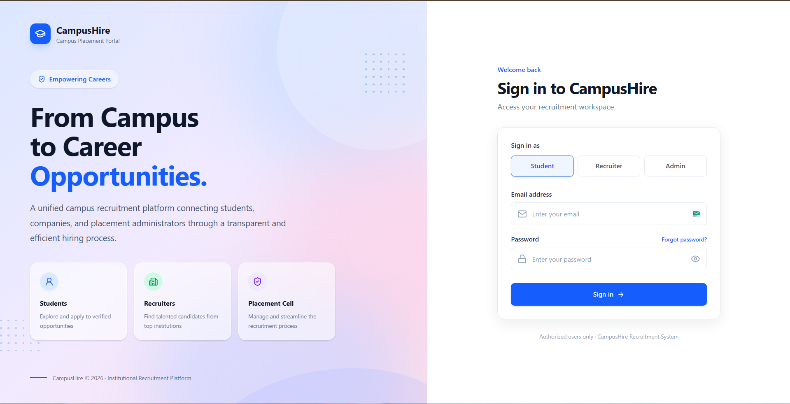
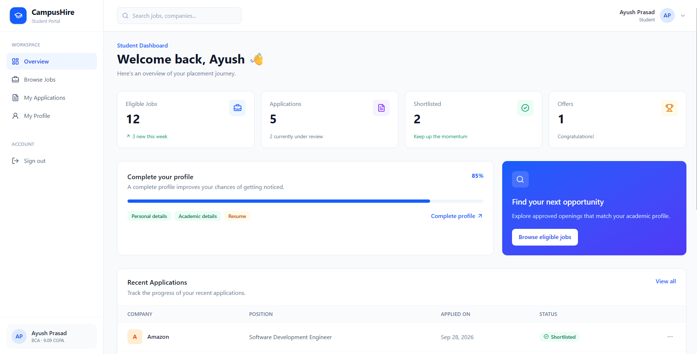
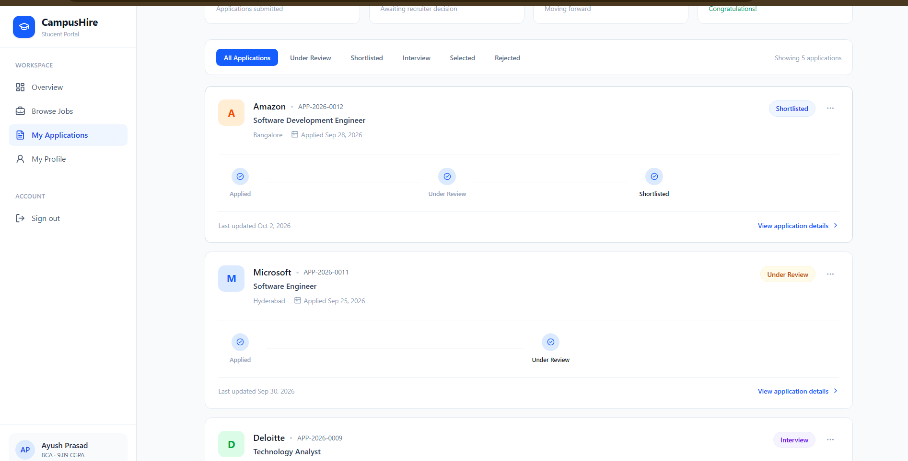
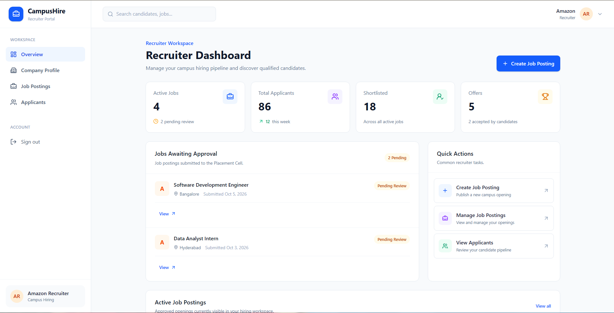
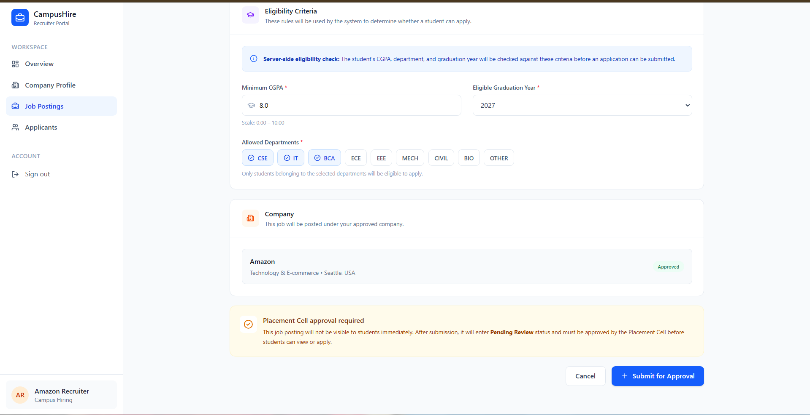
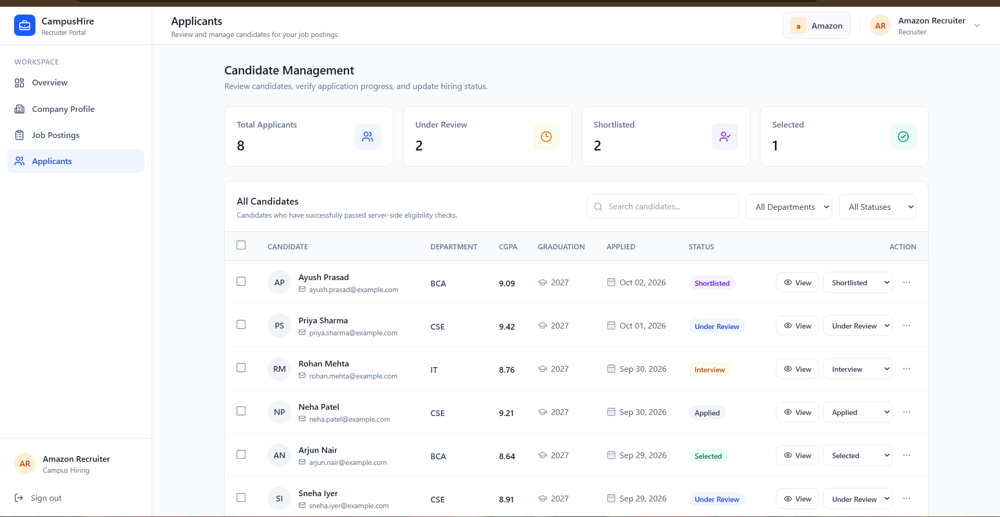
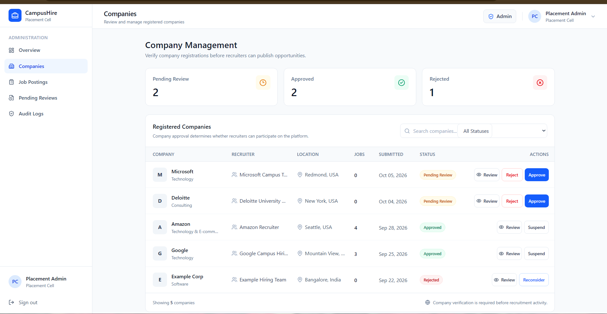
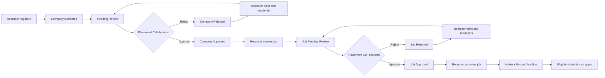
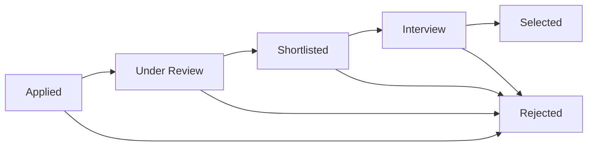
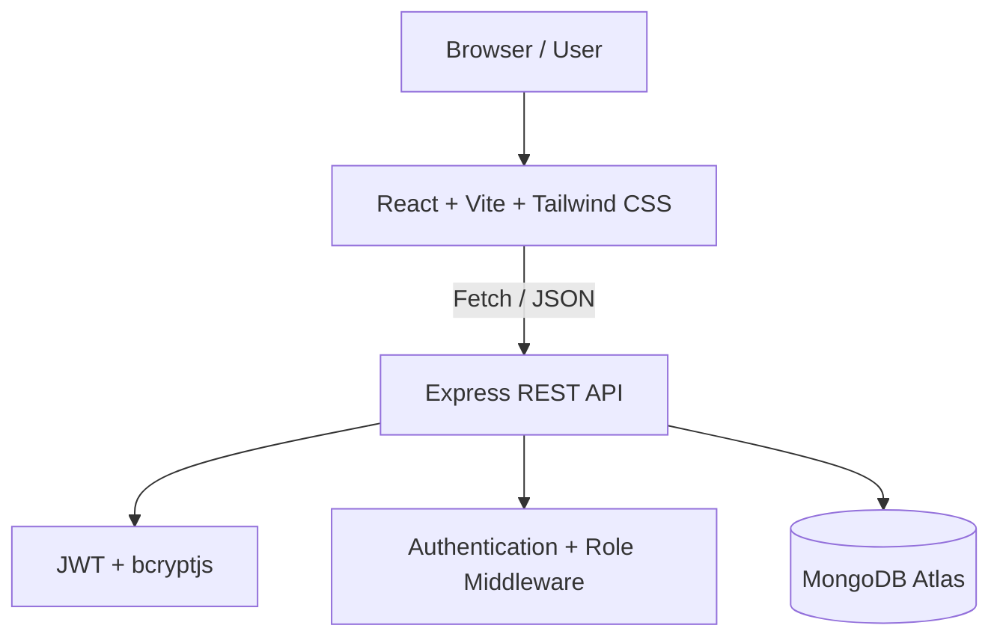

<div align="center">

# CampusHire

### Full-Stack Campus Placement & Recruitment Platform

A production-deployed MERN-style application for managing university recruitment through dedicated student, recruiter, and placement-cell workflows, with company and job approvals, server-side eligibility checks, application tracking, and audit logging.

<p>
  <a href="https://campushirebyayush.vercel.app/">
    
  </a>
  <a href="https://github.com/ayushprasad06/CampusHire">
    
  </a>
</p>

<p>
  
  
  
  
  
  
</p>

</div>

---

## 🔗 Live Demo

### [Open CampusHire →](https://campushirebyayush.vercel.app/)

| Layer | Technology | Deployment |
|---|---|---|
| Frontend | React + Vite + Tailwind CSS | Vercel |
| Backend | Node.js + Express | Render |
| Database | MongoDB Atlas | MongoDB Cloud |

> The live application is the primary demonstration of the project. The screenshots below showcase the core product experience across student, recruiter, and placement-cell workflows.

---

## 📸 Product Preview

### 🔐 Authentication & Role Selection

<p align="center">
  
</p>

### 👤 Student Dashboard

<p align="center">
  
</p>

### 📋 Student Applications

<p align="center">
  
</p>

### 🏢 Recruiter Dashboard

<p align="center">
  
</p>

### 🎯 Job Posting & Eligibility Rules

<p align="center">
  
</p>

### 👥 Candidate Management

<p align="center">
  
</p>

### 🛡️ Placement Cell Company Management

<p align="center">
  
</p>

---

## 💡 About the Project

CampusHire is a full-stack campus recruitment platform built around a realistic university placement lifecycle.

The system connects students looking for opportunities, recruiters managing company and job postings, and the placement cell responsible for reviewing and approving recruitment activity before it reaches students.

The platform separates permissions and workflows for three roles:

- **Student** — maintains an academic profile, discovers eligible openings, applies for jobs, and tracks application progress
- **Recruiter** — registers a company, creates approved job postings, reviews candidates, and manages hiring status
- **Placement Cell Admin** — verifies companies, approves or rejects job postings, monitors recruitment activity, and maintains an audit trail

---

## ✨ Core Features

### 👤 Student

- Register and authenticate as a student
- Maintain personal and academic profile information
- Store department, CGPA, graduation year, phone number, and resume link
- Browse active placement openings
- View company and job details
- See job eligibility requirements
- Apply to eligible jobs
- Prevent duplicate applications
- Receive clear server-side eligibility explanations when an application is rejected
- Track application progress through a multi-stage hiring pipeline
- View the history of application status changes

### 🏢 Recruiter

- Register and authenticate as a recruiter
- Create and manage a company profile
- Submit a company for Placement Cell approval
- Edit rejected company registrations and resubmit them for review
- Create job postings under an approved company
- Define minimum CGPA, allowed departments, graduation year, skills, and application deadline
- Submit jobs for admin approval
- Edit rejected job postings and resubmit them for review
- Activate approved job postings
- Close active job postings
- View applicants across recruiter-owned jobs
- Search and filter candidates
- Review candidate profiles and resumes
- Update application status individually
- Update multiple candidate statuses in batch

### 🛡️ Placement Cell Admin

- Dedicated Placement Cell administration portal
- Dashboard with recruitment overview statistics
- Review registered companies before recruitment activity is enabled
- Approve or reject company registrations
- Review submitted job postings
- Approve or reject job postings
- Record rejection reasons
- View company and job approval status
- Monitor recent administrative activity
- View searchable and filterable audit logs
- Preserve reviewer identity and approval/rejection timestamps

---

## 🔄 Recruitment Lifecycle

CampusHire separates company verification, job approval, job activation, and student eligibility into distinct steps.



### Company Approval Statuses

| Status | Meaning |
|---|---|
| `PENDING_REVIEW` | Company registration is waiting for Placement Cell review |
| `APPROVED` | Company has been verified and can create recruitment openings |
| `REJECTED` | Company registration was rejected and can be edited and resubmitted |

### Job Posting Statuses

| Status | Meaning |
|---|---|
| `PENDING_REVIEW` | Job posting is waiting for Placement Cell approval |
| `APPROVED` | Job posting has been approved by the Placement Cell |
| `ACTIVE` | Job is live and can accept eligible student applications |
| `CLOSED` | Recruiter has closed the active job posting |
| `REJECTED` | Job posting was rejected and can be edited and resubmitted |

---

## 🎯 Eligibility-First Applications

A job is not considered eligible simply because it is visible to a student. The backend validates the candidate against the job requirements before creating an application.

```text
Student Profile
      │
      ├── CGPA >= Minimum CGPA
      │
      ├── Department ∈ Allowed Departments
      │
      ├── Graduation Year = Required Year
      │
      ├── Job Status = ACTIVE
      │
      └── Application Deadline > Current Time
                │
                ▼
          Application Allowed
```

The server performs these checks so eligibility cannot be bypassed by relying only on frontend controls.

Examples of rejected applications include:

- CGPA below the required minimum
- Department not included in the job's allowed departments
- Graduation year does not match the posting
- Student profile is missing required academic information
- Job is not currently accepting applications
- Application deadline has passed
- Student has already applied to the same job

---

## 📈 Application Lifecycle

Once a student successfully applies, the recruiter can move the candidate through the hiring pipeline.



The backend also preserves status history for each application.

### Application Statuses

| Status | Meaning |
|---|---|
| `APPLIED` | Application submitted successfully |
| `UNDER_REVIEW` | Recruiter is reviewing the candidate |
| `SHORTLISTED` | Candidate has progressed to the shortlist |
| `INTERVIEW` | Candidate has reached the interview stage |
| `SELECTED` | Candidate has been selected |
| `REJECTED` | Candidate has been rejected from the hiring process |

When recruiters move an application forward, existing stage timestamps are preserved. When a stage is skipped, the intermediate stage is recorded consistently, and moving backward rebuilds the future portion of the timeline.

---

## 📝 Application Tracking

Students can track applications from a dedicated application workspace rather than relying on a single status field.

```text
Applied
   ↓
Under Review
   ↓
Shortlisted
   ↓
Interview
   ↓
Selected
```

The application model stores both the current status and historical status entries, including:

- Status
- User responsible for the change
- Timestamp of the change

Recruiters can manage the same workflow from the candidate management view and update one or multiple applications together.

---

## 🔐 Authentication & Authorization

The backend implements:

- JWT-based authentication
- Password hashing with bcryptjs
- Protected API routes
- Role-based authorization middleware
- Student / Recruiter / Admin permissions
- Authenticated API requests from the React client
- Ownership checks for recruiter company, jobs, and applications

```text
                     ┌──────────────┐
                     │     User     │
                     └──────┬───────┘
                            │
             ┌──────────────┼──────────────┐
             ▼              ▼              ▼
          Student        Recruiter        Admin
             │              │              │
          Profile        Company          Review
          Eligibility     Jobs            Approval
          Applications    Applicants      Audit Logs
```

Admin account creation is intentionally not exposed through the public registration flow; only Student and Recruiter accounts can register through the application.

---

## 🏗️ Application Architecture



### Request Flow

```text
React Component
      ↓
API Service / Fetch
      ↓
Express Route
      ↓
Authentication Middleware
      ↓
Role Middleware
      ↓
Controller
      ↓
Mongoose Model
      ↓
MongoDB Atlas
      ↓
JSON Response
      ↓
React UI
```

### Approval Flow

```text
Recruiter
   ↓
Company Registration
   ↓
PENDING_REVIEW
   ↓
Placement Cell
   ↓
APPROVED / REJECTED
   ↓
Approved Company
   ↓
Job Posting
   ↓
PENDING_REVIEW
   ↓
Placement Cell
   ↓
APPROVED / REJECTED
   ↓
Recruiter Activation
   ↓
ACTIVE
   ↓
Server-side Eligibility Check
   ↓
Student Application
```

---

## 🧰 Tech Stack

### Frontend

| Technology | Purpose |
|---|---|
| React | Component-based user interface |
| Vite | Frontend tooling and build system |
| React Router | Client-side routing and protected navigation |
| Tailwind CSS | Responsive UI styling |
| Fetch API | REST API communication |
| Lucide React | Interface icons |
| Oxlint | Frontend linting |

### Backend

| Technology | Purpose |
|---|---|
| Node.js | JavaScript runtime |
| Express | REST API framework |
| Mongoose | MongoDB ODM and schema modeling |
| JWT | Authentication and session authorization |
| bcryptjs | Password hashing |
| CORS | Cross-origin API access |
| dotenv | Environment configuration |
| Morgan | HTTP request logging |

### Database & Deployment

| Technology | Purpose |
|---|---|
| MongoDB Atlas | Cloud database |
| Vercel | Frontend deployment |
| Render | Backend deployment |
| GitHub | Source control and repository hosting |

---

## 📁 Project Structure

```text
CampusHire/
│
├── backend/
│   ├── src/
│   │   ├── config/
│   │   │   └── db.js
│   │   ├── controllers/
│   │   │   ├── adminController.js
│   │   │   ├── applicationController.js
│   │   │   ├── auditLogController.js
│   │   │   ├── authController.js
│   │   │   ├── companyController.js
│   │   │   ├── jobController.js
│   │   │   └── userController.js
│   │   ├── middleware/
│   │   │   ├── authMiddleware.js
│   │   │   └── roleMiddleware.js
│   │   ├── models/
│   │   │   ├── Application.js
│   │   │   ├── AuditLog.js
│   │   │   ├── Company.js
│   │   │   ├── Job.js
│   │   │   └── User.js
│   │   ├── routes/
│   │   │   ├── adminRoutes.js
│   │   │   ├── applicationRoutes.js
│   │   │   ├── auditLogRoutes.js
│   │   │   ├── authRoutes.js
│   │   │   ├── companyRoutes.js
│   │   │   ├── jobRoutes.js
│   │   │   ├── testRoutes.js
│   │   │   └── userRoutes.js
│   │   ├── utils/
│   │   ├── seed.js
│   │   └── server.js
│   ├── .gitignore
│   ├── package.json
│   └── package-lock.json
│
├── frontend/
│   ├── public/
│   │   ├── campushire-icon.png
│   │   ├── favicon.svg
│   │   └── icons.svg
│   ├── src/
│   │   ├── api/
│   │   │   ├── admin.js
│   │   │   ├── applications.js
│   │   │   ├── auditLogs.js
│   │   │   ├── auth.js
│   │   │   ├── companies.js
│   │   │   ├── jobs.js
│   │   │   ├── users.js
│   │   │   └── api.js
│   │   ├── components/
│   │   │   └── ProtectedRoute.jsx
│   │   ├── pages/
│   │   │   ├── admin/
│   │   │   ├── auth/
│   │   │   ├── recruiter/
│   │   │   └── student/
│   │   ├── assets/
│   │   ├── App.css
│   │   ├── App.jsx
│   │   ├── index.css
│   │   └── main.jsx
│   ├── vercel.json
│   ├── vite.config.js
│   ├── index.html
│   ├── package.json
│   └── package-lock.json
│
├── .gitignore
└── README.md
```

---

## 🔌 API Overview

The backend exposes protected REST endpoints grouped by responsibility.

| Resource | Purpose |
|---|---|
| `/api/auth` | Student and Recruiter registration and login |
| `/api/users` | Current student profile retrieval and updates |
| `/api/companies` | Recruiter company registration and management; company review routes |
| `/api/jobs` | Job creation, management, approval, activation, closure, and student availability |
| `/api/applications` | Student applications and recruiter candidate management |
| `/api/admin` | Placement Cell dashboard, companies, jobs, approvals, and audit access |
| `/api/audit-logs` | Placement Cell audit log retrieval |

Authenticated requests use:

```http
Authorization: Bearer <JWT_TOKEN>
```

The backend also contains protected test endpoints under `/api/test` for authentication and role-access verification during development.

---

## ⚙️ Local Development

### 1. Clone the repository

```bash
git clone https://github.com/ayushprasad06/CampusHire.git
cd CampusHire
```

### 2. Install backend dependencies

```bash
cd backend
npm install
```

### 3. Configure backend environment

Create:

```text
backend/.env
```

```env
PORT=5000
MONGO_URI=your_mongodb_connection_string
JWT_SECRET=your_jwt_secret
```

### 4. Start the backend

```bash
npm run dev
```

The backend will run locally on port `5000` by default.

### 5. Install frontend dependencies

Open another terminal:

```bash
cd CampusHire/frontend
npm install
```

### 6. Configure frontend environment

Create:

```text
frontend/.env
```

```env
VITE_API_BASE_URL=http://localhost:5000/api
```

The frontend also includes a local fallback to `http://localhost:5000/api` when the variable is not present.

### 7. Start the frontend

```bash
npm run dev
```

The React application will communicate with the Express REST API through the configured API base URL.

> **Security:** Never commit `.env` files, database credentials, JWT secrets, or other private environment values to GitHub.

---

## 🌐 Deployment

### Frontend

```text
React + Vite + Tailwind CSS
            ↓
          Vercel
            ↓
   Production Web Application
```

Live frontend:

**https://campushirebyayush.vercel.app/**

The Vercel project uses the `frontend` directory as its root directory and includes a SPA rewrite so React Router routes continue working correctly after browser refreshes.

### Backend

```text
Node.js + Express
        ↓
      Render
        ↓
      REST API
```

Live backend:

**https://campushire-backend-13el.onrender.com**

The Render service uses the `backend` directory as its root directory and reads production configuration from Render environment variables.

### Database

```text
Express API
      ↓
   Mongoose
      ↓
 MongoDB Atlas
```

The deployed backend connects to MongoDB Atlas using the production `MONGO_URI` environment variable.

### Production API Configuration

The Vercel frontend uses:

```env
VITE_API_BASE_URL=https://campushire-backend-13el.onrender.com/api
```

The frontend and backend are deployed separately and communicate through the production REST API.

---

## 🧪 End-to-End Workflow

A complete CampusHire workflow can be tested using the three application roles:

```text
Recruiter registers
        ↓
Company registration
        ↓
Pending Review
        ↓
Placement Cell approves company
        ↓
Company Approved
        ↓
Recruiter creates job
        ↓
Job Pending Review
        ↓
Placement Cell approves job
        ↓
Job Approved
        ↓
Recruiter activates job
        ↓
Job Active
        ↓
Student completes profile
        ↓
Server-side eligibility checks
        ↓
Eligible student applies
        ↓
Application: APPLIED
        ↓
Recruiter reviews candidate
        ↓
UNDER_REVIEW
        ↓
SHORTLISTED
        ↓
INTERVIEW
        ↓
SELECTED / REJECTED
```

### Eligibility Rejection Workflow

```text
Student attempts application
        ↓
Backend checks profile
        ↓
CGPA check
        ↓
Department check
        ↓
Graduation year check
        ↓
Job status + deadline check
        ↓
Eligible? ────────────────┐
   │                      │
  Yes                    No
   │                      │
   ▼                      ▼
Create Application    Return clear reason
```

### Batch Candidate Workflow

```text
Recruiter Applicant Management
            ↓
Select multiple candidates
            ↓
Choose hiring status
            ↓
Batch status update
            ↓
Each application history updated
```

### Audit Workflow

```text
Placement Cell action
        ↓
Company / Job approval decision
        ↓
Audit log created
        ↓
Action + Target + Reviewer + Timestamp
        ↓
Visible in Audit Logs
```

---

## 🎯 What This Project Demonstrates

CampusHire was built to demonstrate practical full-stack development and business workflow concepts:

- Full-stack React + Node.js application architecture
- REST API design
- JWT authentication
- Password hashing with bcryptjs
- Role-based access control
- Protected frontend routes
- MongoDB data modeling with Mongoose
- CRUD operations across multiple resources
- Company and job approval workflows
- Server-side eligibility validation
- Multi-stage application tracking
- Status-history modeling and timeline reconstruction
- Individual and batch candidate status updates
- Recruiter ownership and authorization checks
- Audit logging for administrative decisions
- Responsive, role-specific dashboard interfaces
- Environment-based local and production API configuration
- Vercel + Render + MongoDB Atlas deployment
- SPA routing configuration for production deployment

---

## 🛣️ Future Improvements

Potential improvements include:

- Email and in-app notifications for application status changes
- Resume file upload and managed document storage
- Interview scheduling and interview feedback
- Student job search, saved jobs, and advanced filtering
- Recruiter analytics and placement reports
- Placement-drive scheduling and campus-wide calendars
- Admin analytics and exportable audit reports
- Institution SSO or college authentication integration
- Automated backend and frontend testing
- CI/CD workflows and automated deployment checks

---

## 👨‍💻 Author

<div align="center">

### Ayush Prasad

**BCA Student • Full-Stack Developer**

<p>
  <a href="https://github.com/ayushprasad06">GitHub</a>
  •
  <a href="https://www.linkedin.com/in/ayushprasad2006">LinkedIn</a>
</p>

</div>

---

<div align="center">

### ⭐ If you found this project interesting, consider giving it a star!

Built with React, Node.js, Express and MongoDB.

</div>
